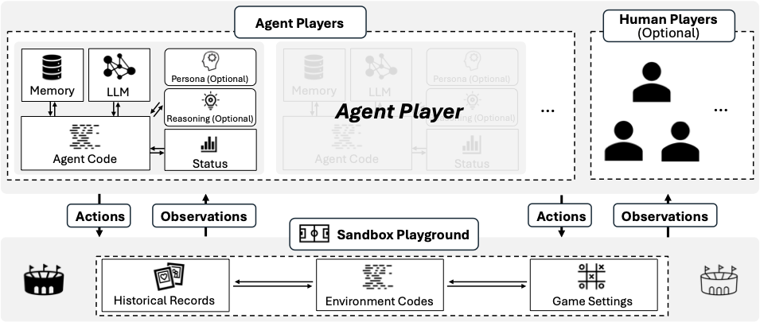

# ALYMPICS: Language Agents Meet Game Theory

**Alympics** is a platform that leverages Large Language Model (LLM) agents to facilitate investigations in game theory.

See our paper: [<font size=5>ALYMPICS: LLM Agents Meet Game Theory -- Exploring Strategic Decision-Making with AI Agents</font>](https://arxiv.org/pdf/2311.03220)

## Architecture of Alympics



The architecture of Alympics comprises the Sandbox Playground and Players. The Sandbox Playground creates an environment where game settings, as specified by researchers, are executed. Agent players, along with the optional human players, actively engage in the game within this environment.

- Sandbox Playground: The Sandbox Playground serves as the environment for conducting games, providing a versatile and controlled space for agent players interactions.
- Agent Players: Agent Players constitute an indispensable component of the Alympics framework, embodying LLM-powered agent entities that participate in strategic interactions within the Sandbox Playground.


## Contributions

- The proposal of an original, LLM agent-based framework to facilitate game theory research.
- The demonstration of Alympics’s application through a comprehensive pilot case study.
- The emphasis on the significance of leveraging LLM agents to scrutinize strategic decision-making within a controlled and reproducible environment. This endeavor not only enriches the field of game theory but also has the potential to inspire research in other domains where decision-making assumes a pivotal role.

## Directory Structure
The code directory structure is
```
$src
 ├─ run.py
 ├─ Utils.py  # The basic Playground class, the Player class and the LLM API
 └─ waterAllocation.py # An example of using playground
```
**Please complete the configuration of LLM in the Utils.py first.**


## Example
Alympics provides a research platform for conducting experiments on complex strategic gaming problems. As a pilot demonstration, we developed a game called the ’Water Allocation Challenge’ to illustrate how it can be leveraged for game theory research.

The details can be found in our paper.

## Water Allocation Challenge: Opponent Info Modes

The programmatic runner supports three meta-round exposure modes that control what is sent to each LLM agent.

Command-line flag:
- --opponent-info-mode {full_code_access|outcome_only|no_opponent_info}

Modes
- full_code_access: includes opponent source code from the previous meta-round (only if REVEAL_OPPONENT_CODE=true) and last-round outcomes for all agents.
- outcome_only: includes last-round outcomes for all agents, but no opponent code.
- no_opponent_info: includes only the agent's own last-round outcome; no opponent data.

LLM input payload (common fields)
- agent_profile: agent_id, water_requirement, daily_salary
- game_state: scenario, supply_range, episode_days, meta_round_id
- history: last_meta_round, self_summary, opponent_summaries (depending on mode)

Outcome summary fields (self_summary / opponent_summaries)
- final_hp, survival_days, average_bid, final_budget, max_bid

Prompt differences
- The prompt header states the active mode and changes the reasoning focus line.
- In full_code_access, the prompt may include an OPPONENT SOURCE CODE block.
- The LATEST METAROUND CONTEXT block always reflects the mode-filtered history.

## Citation

```
@misc{mao2023alympics,
      title={ALYMPICS: Language Agents Meet Game Theory}, 
      author={Shaoguang Mao and Yuzhe Cai and Yan Xia and Wenshan Wu and Xun Wang and Fengyi Wang and Tao Ge and Furu Wei},
      year={2023},
      eprint={2311.03220},
      archivePrefix={arXiv},
      primaryClass={cs.CL}
}
```
